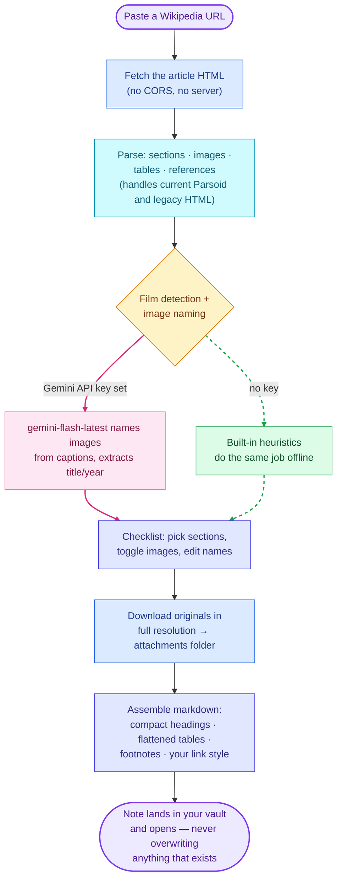
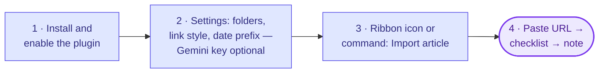

# Advanced Wikipedia Importer

> *"When you cut into the present the future leaks out."* — William S. Burroughs

An [Obsidian](https://obsidian.md) plugin that imports Wikipedia articles as clean, structured notes — sections you choose, images downloaded and renamed to your convention, tables flattened without breaking, references preserved as real footnotes. Fully self-contained: no server, no account, nothing to install beyond the plugin itself.

## Why this exists

Reading about something and *remembering* it turn out to differ. You watch a film, fall down a Wikipedia rabbit hole, close the tab — and a month later the details have evaporated. The article held everything worth keeping, but it lived in a browser, not in your vault, so your notes never touched it.

This plugin removes that friction. One command turns the article into a real note: linkable, searchable, and ready for your own thoughts right alongside the source material. Wikilinks connect it to everything else you've captured, the images come along, the tables survive. The less work capture takes, the more you capture — and the more you capture, the more your vault behaves like an actual second brain instead of a pile of good intentions.

The plugin began as a film diary. Its author studies the movies he watches, and every film carries a Wikipedia entry — cast, production, reception, the poster. Importing the entry right after the credits roll preserves what he watched and gives his own notes a permanent home. Film articles therefore get first-class treatment: the importer detects them, extracts the title and release year, names the note `Title (Year)`, and labels the theatrical release poster cleanly. But the machinery underneath — section parsing, image handling, table flattening, footnotes — works on **any** Wikipedia article: philosophers, battles, algorithms, birds. The film path just arrives pre-sharpened.

Other importers exist; none of them treated a film article the way a film diary wants, ran start to finish inside Obsidian with the tables left standing, and still worked on a phone with no server anywhere. So this one does. You can have it for free.

## How it works

Everything happens inside the plugin — fetch, parse, and assembly all run in-process:



Some details worth knowing:

- **Tables survive.** Wikipedia tables full of `colspan` and `rowspan` flatten into a stable grid — spanned values repeat so every row reads complete, and wikilink pipes get escaped so nothing breaks the column layout.
- **References become footnotes.** Citation markers in the text (`[^smith-3]`) match their definitions at the bottom, using Wikipedia's own citation ids. Or switch them off entirely.
- **Images arrive full-size.** Thumbnails resolve to the original upload; layout icons and UI cruft get filtered out. Every filename remains editable before import.
- **Four link styles.** Wikilinks `[[Target|Text]]` (they resolve the moment you import the linked article too), standard markdown, comment-hidden `Text%%[Link](URL)%%`, or plain text.

## Setup



1. **Install** (see below) and enable the plugin.
2. **Settings** (all optional — the defaults work):
   - **Note folder** and **attachments folder** — where notes and images land.
   - **Link mode** — how article links render (wikilink by default).
   - **Omit references** — for shorter notes.
   - **Date-prefixed image names** — filenames like `2026 07 11 The Gambler (2014) Theatrical Release Poster`, so attachments sort chronologically. Toggle off for caption-only names.
   - **Gemini API key** — optional. With one, `gemini-flash-latest` reads the captions and writes better image names; without one, built-in heuristics handle film detection and naming completely offline.
3. **Import**: click the book ribbon icon or run **Import article** from the command palette, paste a URL, press *Analyze page*.
4. **Choose**: tick sections, tick images, edit any filename, adjust the film title/year if the article covers one. Press *Import article*. The note opens when done.

## Rules of the game

Every tool encodes assumptions; these deserve stating plainly rather than discovering painfully.

- **Nothing gets overwritten.** A finished note lands under a fresh name and opens; a note that already exists at that path stays untouched. Capture never costs you old work.
- **Both HTML shapes parse.** Wikipedia serves articles as current Parsoid markup (nested `<section>` wrappers) *and*, on some pages, older flat markup. The parser reads either, and the test suite pins both against fixtures — so a redesign upstream doesn't silently break your imports.
- **Film gets a sharpened path; everything else still cuts.** Film detection, `Title (Year)` naming, and poster labeling apply when the article warrants them, and step aside cleanly when it doesn't. Philosophers, battles, algorithms, and birds import on the same machinery.
- **Offline by default, Gemini strictly optional.** Every Gemini-assisted feature — film detection, image naming — carries a built-in heuristic fallback. No API key means no network call to Google and no lost capability, just plainer image names.
- **It runs on the phone.** The plugin bundles to a browser-platform build with no Node built-ins, so mobile Obsidian imports exactly as the desktop does.
- **Dates follow your clock.** Image-name prefixes read the date from your device's own timezone, not UTC — a late-night import keeps tonight's date instead of rolling forward to tomorrow.

## Privacy and network use

The plugin talks to exactly two places: `wikipedia.org` (article HTML) and `upload.wikimedia.org` (images you selected). If — and only if — you supply an API key, it also sends the article's title, lead section, infobox text, and image captions to Google's Gemini API for naming suggestions. No key, no call. Nothing else leaves your vault, and the plugin collects nothing.

## The web dashboard (optional, separate)

This repository also contains the importer's older sibling: a local web GUI (`npm start`, then `http://localhost:3000`) with live markdown preview, running on the **same** parser and markdown modules the plugin bundles (`src/`). The plugin needs none of it — but if you prefer importing from a browser outside Obsidian, the dashboard remains fully functional. One implementation, two doors.

## Installing

Until the plugin lands in the community catalog, install with [BRAT](https://github.com/TfTHacker/obsidian42-brat) pointed at this repo, or copy `main.js`, `manifest.json`, and `styles.css` from a [release](https://github.com/DyllonWright/Wikipedia-To-Obsidian-Markdown/releases) into `<vault>/.obsidian/plugins/advanced-wikipedia-importer/`.

Upgrading from the pre-2.0 build (the one that needed a local Node server)? Your `data.json` migrates automatically — formatting preferences carry over, and the server-related settings retire quietly. The server itself no longer needs to run for the plugin to work.

## Developing

```bash
npm install
npm run dev     # esbuild watch mode (plugin bundle)
npm run build   # typecheck + production bundle
npm test        # parser / markdown / heuristics suite — keep it green
npm start       # optional: the local web GUI
```

The layout separates what runs where:

- `src/` — shared CommonJS modules: `parser.js` (cheerio-based structure extraction), `markdown.js` (assembly, link modes, spacing), `fallback.js` (offline film detection and naming). The plugin bundles these; the server requires them. One source of truth, tested directly by `test/run.mjs` — including a fixture for Wikipedia's current Parsoid HTML *and* the legacy markup, since articles arrive in both shapes.
- `plugin/` — the TypeScript plugin shell: modal UI, settings with migration, the Gemini REST client, and the import pipeline.
- `server.js` + `public/` — the optional web dashboard.

One stylistic note: the README keeps to [E-Prime](https://en.wikipedia.org/wiki/E-Prime) — English without any form of "to be" — a small tribute to Korzybski, who taught that "the map is not the territory," and to Robert Anton Wilson, who kept the lesson funny. A tool that turns encyclopedia maps into personal ones might as well mind the difference.

## License

MIT

---

*A footnote for the ones who track these things.*

*This release carries version 2.3.0 — a 2 and a 3 with a nought pushed to the end — cut on July 23, the day I found the bug it fixes. That bug rolled a date forward into a day it never lived, because a machine measured "today" against a line drawn through Greenwich instead of the one under my feet. Which day counts as today has never held still; that same arbitrariness runs my other plugin's eleven calendars at once, and it already gave July 23 a name — Maybe Day, as Robert Anton Wilson's readers keep it.*

*Wilson spent decades logging the 23 enigma — coincidences clustering on that number — and traced the fixation to a story William S. Burroughs told him, the same Burroughs who opens this page. He read it as one thread in the synchronicity mesh* Cosmic Trigger *keeps circling: the Sirius transmissions, the Dog Star whose dawn rising opens the Dog Days on this very date, and the idea that language itself came from somewhere off-world — "a virus from outer space," in Burroughs' phrase.*

*So weigh one evening's ledger. I caught the arbitrary-date bug on the 23rd while watching* Naked Lunch *— Cronenberg's film of the Burroughs novel, all talking typewriters and weaponized words, all insistence that the dates and the borders stay arbitrary. That same week I had written the Robert Anton Wilson Trust about the calendar plugin; the reply arrived mid-film, inside two hours of close of business, and signed off the way that circle signs off — keep the lasagna flying. Version, date, epigraph, film, letter: five knots, one mesh. Make of it what you will. Wilson would have said "maybe."*
