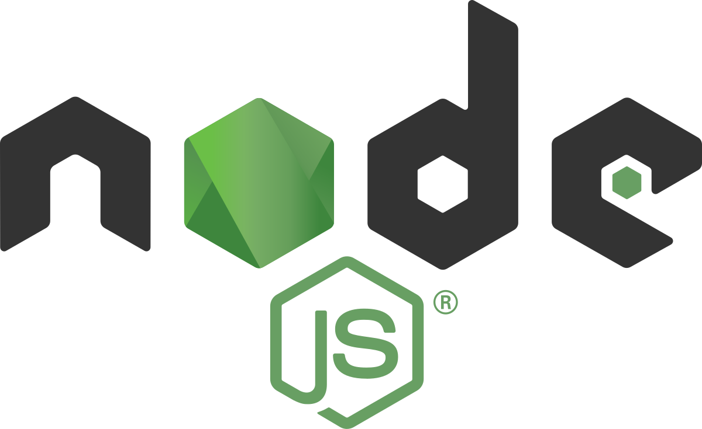

# [Node.js](https://en.wikipedia.org/wiki/Node.js)

Node.js is a cross-platform, open-source JavaScript runtime environment that can run on Windows, Linux, Unix, macOS, and more. Node.js runs on the V8 JavaScript engine, and executes JavaScript code outside a web browser. According to the Stack Overflow Developer Survey, Node.js is one of the most commonly used web technologies.

Node.js lets developers use JavaScript to write command line tools and server-side scripting. The ability to run JavaScript code on the server is often used to generate dynamic web page content before the page is sent to the user's web browser. Consequently, Node.js represents a "JavaScript everywhere" paradigm, unifying web-application development around a single programming language, as opposed to using different languages for the server- versus client-side programming.

Node.js has an event-driven architecture capable of asynchronous I/O. These design choices aim to optimize throughput and scalability in web applications with many input/output operations, as well as for real-time Web applications (e.g., real-time communication programs and browser games).

The Node.js distributed development project was previously governed by the Node.js Foundation, and has now merged with the JS Foundation to form the OpenJS Foundation. OpenJS Foundation is facilitated by the Linux Foundation's Collaborative Projects program.

## History

*Ryan Dahl, creator of Node.js, in 2010*

*Rocket Turtle, the official mascot of Node.js since February 2024*

Node.js was initially written by [Ryan Dahl](https://en.wikipedia.org/wiki/Ryan_Dahl) in 2009, about 13 years after the introduction of the first server-side JavaScript environment, [Netscape's](https://en.wikipedia.org/wiki/Netscape) LiveWire Pro Web. The initial release supported only Linux and Mac OS X. Its development and maintenance was led by Dahl and later sponsored by [Joyent](https://en.wikipedia.org/wiki/Joyent).

Dahl criticized the limited capability of [Apache HTTP Server](https://en.wikipedia.org/wiki/Apache_HTTP_Server) to handle many (10,000+) concurrent connections, as well as the dominant programming paradigm of sequential programming, in which applications could block entire processes or cause the creation of multiple execution stacks for simultaneous connections. [citation needed]

Dahl demonstrated the project at the inaugural European JSConf on November 8, 2009. Node.js combined [Google's](https://en.wikipedia.org/wiki/Google) [V8 JavaScript engine](https://en.wikipedia.org/wiki/V8_(JavaScript_engine)), an [event loop](https://en.wikipedia.org/wiki/Event_loop), and a low-level [I/O](https://en.wikipedia.org/wiki/Input/output) [API](https://en.wikipedia.org/wiki/Application_programming_interface).

In January 2010, a [package manager](https://en.wikipedia.org/wiki/Package_manager) was introduced for the Node.js environment called [npm](https://en.wikipedia.org/wiki/Npm_(software)). The package manager allows programmers to publish and share Node.js packages, along with the accompanying source code, and is designed to simplify the installation, update and uninstallation of packages.

In June 2011, Microsoft and Joyent implemented a native [Windows](https://en.wikipedia.org/wiki/Microsoft_Windows) version of Node.js. The first Node.js build supporting Windows was released in July 2011.

In January 2012, Dahl yielded management of the project to npm creator Isaac Schlueter. In January 2014, Schlueter announced that Timothy J. Fontaine would lead the project.

In December 2014, Fedor Indutny created io.js, a [fork](https://en.wikipedia.org/wiki/Fork_(software_development)) of Node.js created because of dissatisfaction with Joyent's governance as an [open-governance](https://en.wikipedia.org/wiki/Open_governance) alternative with a separate technical committee. The goal was to enable a structure that would be more receptive to community input, including the updating of io.js with the latest Google V8 JavaScript engine releases, diverging from Node.js's approach at that time.

The Node.js Foundation, formed to reconcile Node.js and io.js under a unified banner, was announced in February 2015. The merger was realized in September 2015 with Node.js v0.12 and io.js v3.3 combining into Node v4.0. This merge brought V8 [ES6](https://en.wikipedia.org/wiki/ECMAScript#ES2015) features into Node.js and started a long-term support release cycle. By 2016, the io.js website recommended returning to Node.js and announced no further io.js releases, effectively ending the fork and solidifying the merger's success.

In 2019, the JS Foundation and Node.js Foundation merged to form the [OpenJS Foundation](https://en.wikipedia.org/wiki/OpenJS_Foundation).

### Branding

The Node.js logo features a green hexagon with overlapping bands to represent the cross-platform nature of the runtime. The Rocket Turtle was chosen as the official Node.js mascot in February 2024 following a design contest.

## Overview

Node.js allows the creation of [web servers](https://en.wikipedia.org/wiki/Web_server) and networking tools using [JavaScript](https://en.wikipedia.org/wiki/JavaScript) and a collection of "modules" that handle various core functionalities. Modules are provided for [file system](https://en.wikipedia.org/wiki/File_system) I/O, networking ([DNS](https://en.wikipedia.org/wiki/Domain_Name_System), [HTTP](https://en.wikipedia.org/wiki/HTTP), [TCP](https://en.wikipedia.org/wiki/Transmission_Control_Protocol), [TLS/SSL](https://en.wikipedia.org/wiki/Transport_Layer_Security) or [UDP](https://en.wikipedia.org/wiki/User_Datagram_Protocol)), [binary](https://en.wikipedia.org/wiki/Binary_file) data (buffers), [cryptography](https://en.wikipedia.org/wiki/Cryptography) functions, [data streams](https://en.wikipedia.org/wiki/Stream_(computing)) and other core functions. Node.js's modules use an API designed to reduce the complexity of writing server applications.

Since version 22.6.0, Node.js natively supports both [JavaScript](https://en.wikipedia.org/wiki/JavaScript) and [TypeScript](https://en.wikipedia.org/wiki/TypeScript), allowing TypeScript files to be executed without a separate compilation step. The TypeScript support was contributed by Node.js TSC member Marco Ippolito. In addition, many [compile-to-JS](https://en.wikipedia.org/wiki/Source-to-source_compiler) languages are available, allowing Node.js applications to also be written in [CoffeeScript](https://en.wikipedia.org/wiki/CoffeeScript), [Dart](https://en.wikipedia.org/wiki/Dart_(programming_language)), [ClojureScript](https://en.wikipedia.org/wiki/ClojureScript), and others.

Node.js is primarily used to build network programs such as web servers. The most significant difference between Node.js and [PHP](https://en.wikipedia.org/wiki/PHP) is that most functions in PHP block until completion (commands execute only after previous commands finish), while Node.js functions are non-blocking (commands execute concurrently and use callbacks to signal completion or failure).

Node.js is officially supported by [Linux](https://en.wikipedia.org/wiki/Linux), macOS and [Microsoft Windows](https://en.wikipedia.org/wiki/Microsoft_Windows) 8.1 and Server 2012 (and later), with Tier 2 support for [SmartOS](https://en.wikipedia.org/wiki/SmartOS) and [IBM AIX](https://en.wikipedia.org/wiki/IBM_AIX) and experimental support for [FreeBSD](https://en.wikipedia.org/wiki/FreeBSD). [OpenBSD](https://en.wikipedia.org/wiki/OpenBSD) also works, and LTS versions are available for [IBM i](https://en.wikipedia.org/wiki/IBM_i) (AS/400). The source code may also be built on similar operating systems that are not officially supported, such as [NonStop OS](https://en.wikipedia.org/wiki/NonStop_OS) and [Unix](https://en.wikipedia.org/wiki/Unix) servers.

### Platform architecture

Node.js enables development of fast web servers in JavaScript using [event-driven programming](https://en.wikipedia.org/wiki/Event-driven_programming). Developers can create scalable servers without using [threading](https://en.wikipedia.org/wiki/Thread_(computing)) by using a simplified model that uses [callbacks](https://en.wikipedia.org/wiki/Callback_(computer_programming)) to signal the completion of a task. [page needed] Node.js connects the ease of a scripting language (JavaScript) with the power of Unix network programming.

Node.js was built on top of Google's V8 JavaScript engine since it was open-sourced under the [BSD license](https://en.wikipedia.org/wiki/BSD_license), and it contains comprehensive support for fundamental protocols such as [HTTP](https://en.wikipedia.org/wiki/HTTP), [DNS](https://en.wikipedia.org/wiki/DNS) and [TCP](https://en.wikipedia.org/wiki/Transmission_Control_Protocol). JavaScript's existing popularity made Node.js accessible to the [web-development community](https://en.wikipedia.org/wiki/Web_developer).

### Industry support

There are thousands of open-source libraries for Node.js, most of which are hosted on the npm website. Multiple developer conferences and events are held that support the Node.js community, including NodeConf, Node Interactive, and Node Summit, as well as a number of regional events.

The open-source community has developed [web frameworks](https://en.wikipedia.org/wiki/Web_framework) to accelerate the development of applications. Such frameworks include [Express.js](https://en.wikipedia.org/wiki/Express.js), [Socket.IO](https://en.wikipedia.org/wiki/Socket.IO), [Sails.js](https://en.wikipedia.org/wiki/Sails.js), [Next.js](https://en.wikipedia.org/wiki/Next.js) and [Meteor](https://en.wikipedia.org/wiki/Meteor_(web_framework)). Various packages have also been created for interfacing with other languages or runtime environments such as [Microsoft .NET](https://en.wikipedia.org/wiki/Microsoft_.NET).

Modern desktop [IDEs](https://en.wikipedia.org/wiki/Integrated_development_environment) provide editing and debugging features specifically for Node.js applications. Such IDEs include [Atom](https://en.wikipedia.org/wiki/Atom_(text_editor)), [Brackets](https://en.wikipedia.org/wiki/Brackets_(text_editor)), [JetBrains](https://en.wikipedia.org/wiki/JetBrains_MPS) [WebStorm](https://en.wikipedia.org/wiki/WebStorm), [Microsoft Visual Studio](https://en.wikipedia.org/wiki/Microsoft_Visual_Studio) (with Node.js Tools for Visual Studio, or [TypeScript](https://en.wikipedia.org/wiki/TypeScript) with Node definitions), [NetBeans](https://en.wikipedia.org/wiki/NetBeans), Nodeclipse Enide Studio ([Eclipse](https://en.wikipedia.org/wiki/Eclipse_(software))-based) and [Visual Studio Code](https://en.wikipedia.org/wiki/Visual_Studio_Code). Some [online IDEs](https://en.wikipedia.org/wiki/Online_integrated_development_environment) also support Node.js, such as [Codeanywhere](https://en.wikipedia.org/wiki/Codeanywhere), [Eclipse Che](https://en.wikipedia.org/wiki/Eclipse_Che), [Cloud9 IDE](https://en.wikipedia.org/wiki/Cloud9_IDE) and the visual flow editor in [Node-RED](https://en.wikipedia.org/wiki/Node-RED).

Node.js is supported across a number of cloud-hosting platforms such as [Jelastic](https://en.wikipedia.org/wiki/Jelastic), [Google Cloud Platform](https://en.wikipedia.org/wiki/Google_Cloud_Platform), [AWS Elastic Beanstalk](https://en.wikipedia.org/wiki/AWS_Elastic_Beanstalk), [Azure Web Apps](https://en.wikipedia.org/wiki/Azure_Web_Apps) and [Joyent](https://en.wikipedia.org/wiki/Joyent).

## Releases

New major releases of Node.js are cut from the [GitHub](https://en.wikipedia.org/wiki/GitHub) main branch every six months. Even-numbered versions are cut in April and odd-numbered versions are cut in October. When a new odd version is released, the previous even version undergoes transition to [Long Term Support](https://en.wikipedia.org/wiki/Long-term_support) (LTS), which gives that version 12 months of active support from the date it is designated LTS. After these 12 months expire, an LTS release receives an additional 18 months of maintenance support. An active version receives non-breaking backports of changes a few weeks after they land in the current release. A maintenance release receives only critical fixes and documentation updates. The LTS Working Group manages strategy and policy in collaboration with the Technical Steering Committee of the Node.js Foundation.

| Release | Status | Code name | Release date | Maintenance end |
|---|---|---|---|---|
| Unsupported: 0.10.x | Unsupported: End-of-Life | | 2013-03-11 | 2016-10-31 |
| Unsupported: 0.12.x | Unsupported: End-of-Life | | 2015-02-06 | 2016-12-31 |
| Unsupported: 4.x | Unsupported: End-of-Life | Argon | 2015-09-08 | 2018-04-30 |
| Unsupported: 5.x | Unsupported: End-of-Life | | 2015-10-29 | 2016-06-30 |
| Unsupported: 6.x | Unsupported: End-of-Life | Boron | 2016-04-26 | 2019-04-30 |
| Unsupported: 7.x | Unsupported: End-of-Life | | 2016-10-25 | 2017-06-30 |
| Unsupported: 8.x | Unsupported: End-of-Life | Carbon | 2017-05-30 | 2019-12-31 |
| Unsupported: 9.x | Unsupported: End-of-Life | | 2017-10-01 | 2018-06-30 |
| Unsupported: 10.x | Unsupported: End-of-Life | Dubnium | 2018-04-24 | 2021-04-30 |
| Unsupported: 11.x | Unsupported: End-of-Life | | 2018-10-23 | 2019-06-01 |
| Unsupported: 12.x | Unsupported: End-of-Life | Erbium | 2019-04-23 | 2022-04-30 |
| Unsupported: 13.x | Unsupported: End-of-Life | | 2019-10-22 | 2020-06-01 |
| Unsupported: 14.x | Unsupported: End-of-Life | Fermium | 2020-04-21 | 2023-04-30 |
| Unsupported: 15.x | Unsupported: End-of-Life | | 2020-10-20 | 2021-06-01 |
| Unsupported: 16.x | Unsupported: End-of-Life | Gallium | 2021-04-20 | 2023-09-11 |
| Unsupported: 17.x | Unsupported: End-of-Life | | 2021-10-19 | 2022-06-01 |
| Unsupported: 18.x | Unsupported: End-of-Life | Hydrogen | 2022-04-19 | 2025-04-30 |
| Unsupported: 19.x | Unsupported: End-of-Life | | 2022-10-18 | 2023-06-01 |
| Unsupported: 20.x | Unsupported: End-of-Life | Iron | 2023-04-18 | 2026-04-30 |
| Unsupported: 21.x | Unsupported: End-of-Life | | 2023-10-17 | 2024-06-01 |
| Supported: 22.x | Supported: Maintenance LTS | Jod | 2024-04-24 | 2027-04-30 |
| Unsupported: 23.x | Unsupported: End-of-Life | | 2024-10-15 | 2025-06-01 |
| Latest version: 24.x | Latest version: Active LTS | Krypton | 2025-04-22 | 2028-04-30 |
| Preview version: 25.x | Preview version: Current | | 2025-10-15 | |
| Future version: 26.x | Future version: Planned | Lithium | 2026 | 2029 |
| Future version: 28.x | Future version: Planned | Magnesium | 2027 | 2030 |
| Future version: 30.x | Future version: Planned | Neon | 2028 | 2031 |
| Future version: 32.x | Future version: Planned | Oxygen | 2029 | 2032 |
| Future version: 34.x | Future version: Planned | Platinum | 2030 | 2033 |

## Technical details

Node.js is a JavaScript runtime environment that processes incoming requests in a loop, called the [event loop](https://en.wikipedia.org/wiki/Event_loop).

### Internals

Node.js uses [libuv](https://en.wikipedia.org/wiki/Libuv) under the hood to handle asynchronous events. Libuv is an abstraction layer for network and file system functionality on both Windows and [POSIX](https://en.wikipedia.org/wiki/POSIX)-based systems such as Linux, [macOS](https://en.wikipedia.org/wiki/MacOS), OSS on [NonStop](https://en.wikipedia.org/wiki/NonStop_(server_computers)), and Unix. Node.js relies on nghttp2 for HTTP support. As of version 20, Node.js uses the ada library which provides up-to-date [WHATWG](https://en.wikipedia.org/wiki/WHATWG) [URL](https://en.wikipedia.org/wiki/URL) compliance. As of version 19.5, Node.js uses the simdutf library for fast Unicode validation and transcoding. As of version 21.3, Node.js uses the simdjson library for fast JSON parsing.

### Threading

Node.js operates on a single-thread [event loop](https://en.wikipedia.org/wiki/Event_loop), using non-blocking I/O calls, allowing it to support tens of thousands of concurrent connections without incurring the cost of thread [context switching](https://en.wikipedia.org/wiki/Context_switch). The design of sharing a single thread among all the requests that use the [observer pattern](https://en.wikipedia.org/wiki/Observer_pattern) is intended for building highly concurrent applications, where any function performing I/O must use a [callback](https://en.wikipedia.org/wiki/Callback_(computer_programming)). To accommodate the single-threaded event loop, Node.js uses the [libuv](https://en.wikipedia.org/wiki/Libuv) library—which, in turn, uses a fixed-sized thread pool that handles some of the non-blocking asynchronous I/O operations.

A thread pool handles the execution of parallel tasks in Node.js. The main thread function call posts tasks to the shared task queue, which threads in the thread pool pull and execute. Inherently non-blocking system functions such as networking translate to kernel-side non-blocking sockets, while inherently blocking system functions such as file I/O run in a blocking way on their own threads. When a thread in the thread pool completes a task, it informs the main thread of this, which in turn, wakes up and executes the registered callback.

A downside of this single-threaded approach is that Node.js does not allow vertical scaling by increasing the number of CPU cores of the machine it is running on without using an additional module, such as cluster, StrongLoop Process Manager, or pm2. However, developers can increase the default number of threads in the libuv thread pool. The server operating system (OS) is likely to distribute these threads across multiple cores. Another problem is that long-lasting computations and other CPU-bound tasks freeze the entire event-loop until completion. [citation needed]

### V8

> **Main article**: [V8 (JavaScript engine)](https://en.wikipedia.org/wiki/V8_(JavaScript_engine))

V8 is the JavaScript execution engine which was initially built for [Google Chrome](https://en.wikipedia.org/wiki/Google_Chrome). It was then open-sourced by Google in 2008. Written in [C++](https://en.wikipedia.org/wiki/C%2B%2B), V8 compiles JavaScript source code to native machine code at runtime. As of 2016, it also includes Ignition, a bytecode interpreter.

### Package management

[npm](https://en.wikipedia.org/wiki/Npm_(software)) is the pre-installed package manager for the Node.js server platform. It installs Node.js programs from the npm registry, organizing the installation and management of third-party Node.js programs.

### Event loop

Node.js registers with the operating system so the OS notifies it of [asynchronous I/O](https://en.wikipedia.org/wiki/Asynchronous_I/O) events such as new connections. Within the Node.js runtime, events trigger callbacks and each connection is handled as a small heap allocation. Traditionally, relatively heavyweight OS processes or threads handled each connection. Node.js uses an event loop for concurrent I/O, instead of processes or threads. In contrast to other event-driven servers, [which?] Node.js's event loop does not need to be called explicitly. Instead, callbacks are defined, and the server automatically enters the event loop at the end of the callback definition. Node.js exits the event loop when there are no further callbacks to be performed.

### WebAssembly

Node.js supports [WebAssembly](https://en.wikipedia.org/wiki/WebAssembly) and as of Node 14 has experimental support of [WASI](https://en.wikipedia.org/wiki/WebAssembly#WASI), the WebAssembly System Interface.

### Native bindings

> See also: [Foreign function interface](https://en.wikipedia.org/wiki/Foreign_function_interface)

Node.js provides a way to create "add-ons" via a [C](https://en.wikipedia.org/wiki/C_(programming_language))-based API called N-API, which can be used to produce loadable (importable) .node modules from source code written in C/C++. The modules can be directly loaded into memory and executed from within JS environment as simple CommonJS modules. The implementation of the N-API relies on internal C/C++ Node.js and V8 objects requiring users to import ([#include](https://en.wikipedia.org/wiki/Include_directive)) Node.js specific headers into their native source code.

As the Node.js API is subject to breaking changes at a binary level, modules have to be built and shipped against specific Node.js versions to work properly. To address the issue, third parties have introduced open-sourced С/С++ wrappers on top of the API that partially alleviate the problem. They simplify interfaces, but as a side effect they may also introduce complexity which maintainers have to deal with. Even though the core functionality of Node.js resides in a JavaScript built-in library, modules written in C++ can be used to enhance capabilities and to improve performance of applications.

In order to produce such modules one needs to have an appropriate C++ compiler and necessary headers (the latter are typically shipped with Node.js itself), e.g., [gcc](https://en.wikipedia.org/wiki/GCC_Compiler), [clang](https://en.wikipedia.org/wiki/Clang) or [MSVC++](https://en.wikipedia.org/wiki/Microsoft_Visual_C%2B%2B).

The N-API is similar to [Java Native Interface](https://en.wikipedia.org/wiki/Java_Native_Interface).

## Project governance

> **Main article**: [OpenJS Foundation](https://en.wikipedia.org/wiki/OpenJS_Foundation)

In 2015, various branches of the greater Node.js community began working under the vendor-neutral Node.js Foundation. The stated purpose of the organization "is to enable widespread adoption and help accelerate development of Node.js and other related modules through an open governance model that encourages participation, technical contribution, and a framework for long-term stewardship by an ecosystem invested in Node.js' success."

The Node.js Foundation Technical Steering Committee (TSC) is the technical governing body of the Node.js Foundation. The TSC is responsible for the core Node.js repo as well as dependent and adjacent projects. Generally the TSC delegates the administration of these projects to working groups or committees. The LTS group that manages long term supported releases is one such group. Other current groups include Website, Streams, Build, Diagnostics, i18n, Evangelism, Docker, Addon API, Benchmarking, Post-mortem, Intl, Documentation, and Testing.

In August 2017, a third of the TSC members resigned due to a dispute related to the project's code of conduct.

**Current TSC Members**

| Username | Full Name |
|---|---|
| aduh95 | Antoine du Hamel |
| anonrig | Yagiz Nizipli |
| benjamingr | Benjamin Gruenbaum |
| BridgeAR | Ruben Bridgewater |
| gireeshpunathil | Gireesh Punathil |
| jasnell | James M Snell |
| joyeecheung | Joyee Cheung |
| legendecas | Chengzhong Wu |
| marco-ippolito | Marco Ippolito |
| mcollina | Matteo Collina |
| mhdawson | Michael Dawson |
| RafaelGSS | Rafael Gonzaga |
| richardlau | Richard Lau |
| ronag | Robert Nagy |
| ruyadorno | Ruy Adorno |
| ShogunPanda | Paolo Insogna |
| targos | Michaël Zasso |
| tniessen | Tobias Nießen |

## Further reading

*   [Up and Running with Node.js](https://books.google.com/books?id=KGt-FxUEj48C&dq=nodejs&pg=PT24), O'Reilly Media, ISBN 978-1-4493-9858-3
*   [Sams Teach Yourself Node.js in 24 Hours](https://books.google.com/books?id=KGt-FxUEj48C&dq=nodejs&pg=PT24), SAMS Publishing, ISBN 978-0-672-33595-2
*   [Professional Node.js](http://eu.wiley.com/WileyCDA/WileyTitle/productCd-1118185463,descCd-authorInfo.html), John Wiley & Sons, ISBN 978-1-118-22754-1
*   [Episode 237: Node.js](https://twit.tv/show/floss-weekly/237), TWiT.tv. Event occurs at 1:08:13
*   [Node.js Recipes: A Problem-Solution Approach](https://books.google.com/books?id=Oda-MgEACAAJ&q=nodejs), Apress, ISBN 978-1-4302-6058-5

## External links

*   [Wikimedia Commons](https://commons.wikimedia.org/wiki/Category:Node.js)
*   [Official website](https://nodejs.org)
